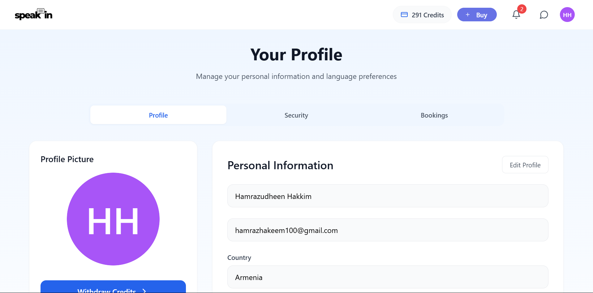

# 🌟 SpeakIn - Language Learning Platform

<div align="center">

[](https://github.com/yourusername/speakin)

[](https://reactjs.org/)
[](https://www.djangoproject.com/)
[](https://www.postgresql.org/)
[](https://microservices.io/)

</div>

## 📸 Project Screenshots

<div align="center">




</div>

## 🎯 About SpeakIn

SpeakIn is a robust language learning platform that connects learners with expert tutors through 1-on-1 video sessions. Our platform ensures quality education by verifying native speakers through government ID and non-native tutors through their language certifications.

### 🌟 Key Features

- **Video Learning Platform**
  - 1-on-1 video sessions powered by Daily.co
  - Session scheduling and management
  - Interactive learning environment

- **Tutor Verification System**
  - Native speaker government ID verification
  - Language certification validation for non-native tutors
  - Detailed tutor profiles

- **User Management**
  - Secure authentication system
  - User profiles and progress tracking
  - Session history and bookings

- **Payment System**
  - Secure payment processing with Stripe
  - Tutor payouts via Stripe Connect
  - Complete payment history

## 🗂️ Project Structure

```
speakin/
├── client/                      # Frontend React Application
│   ├── src/                    # Source files
│   │   ├── components/         # React components
│   │   ├── pages/             # Page components
│   │   ├── store/             # Redux store
│   │   ├── hooks/             # Custom hooks
│   │   ├── utils/             # Utility functions
│   │   └── App.tsx            # Root component
│   ├── vite.config.js         # Vite configuration
│   ├── tailwind.config.js     # Tailwind CSS config
│   └── package.json           # Frontend dependencies
│
├── server/                     # Backend Microservices
│   ├── api_gateway/           # API Gateway Service
│   │   ├── src/              # Source files
│   │   └── requirements.txt   # Python dependencies
│   ├── user_service/          # User Management Service
│   │   ├── src/              # Source files
│   │   └── requirements.txt   # Python dependencies
│   ├── session_service/       # Video Session Service
│   │   ├── src/              # Source files
│   │   └── requirements.txt   # Python dependencies
│   ├── message_service/       # Messaging Service
│   │   ├── src/              # Source files
│   │   └── requirements.txt   # Python dependencies
│   ├── payment_service/       # Payment Processing Service
│   │   ├── src/              # Source files
│   │   └── requirements.txt   # Python dependencies
│   ├── k8s/                   # Kubernetes configurations
│   └── docker-compose.yml     # Docker composition file
```

## 🚀 Getting Started

### Prerequisites
- Docker
- Docker Compose
- Django (for local development)

### Running Backend Services

1. Pull the microservice images:
```powershell
docker pull hamrazhakeem/speakin-api-gateway:latest
docker pull hamrazhakeem/speakin-user-service:latest
docker pull hamrazhakeem/speakin-session-service:latest
docker pull hamrazhakeem/speakin-message-service:latest
docker pull hamrazhakeem/speakin-payment-service:latest
```

2. Start the services:
```powershell
cd server
docker-compose up -d
```

### Running Frontend Locally

1. Clone the repository and install dependencies:
```powershell
git clone <repository-url>
cd client
npm install
```

2. Start the development server:
```powershell
npm run dev
```

3. Access the application:
- Frontend: http://localhost:5173
- API Gateway: http://localhost:8000

## 🔧 Tech Stack

- **Frontend**
  - React with Vite
  - TailwindCSS
  - Redux Toolkit
  - Daily.co SDK

- **Backend**
  - Django REST Framework
  - PostgreSQL
  - Redis Cache
  - Celery

- **Infrastructure**
  - Docker
  - Kubernetes
  - AWS Application Load Balancer
  - AWS Services

## 👥 Contributing

We welcome contributions! Here's how you can help:

1. Fork the repository
2. Create a feature branch (`git checkout -b feature/AmazingFeature`)
3. Commit your changes (`git commit -m 'Add some AmazingFeature'`)
4. Push to the branch (`git push origin feature/AmazingFeature`)
5. Open a Pull Request

## 📬 Contact

For support or queries, reach out to us at [support@speakin.com](mailto:support@speakin.com)

---

<div align="center">
  <sub>Built with ❤️ for language learners worldwide</sub>
</div>