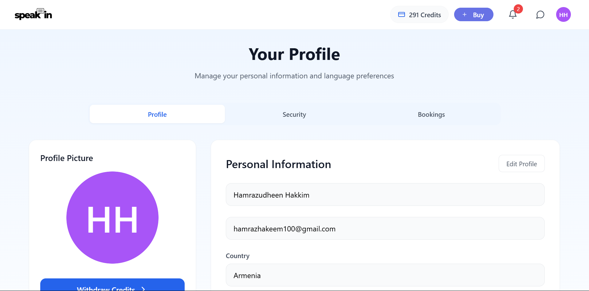

# 🌟 SpeakIn - Language Learning Platform

<div align="center">

[](https://github.com/yourusername/speakin)

[](https://reactjs.org/)
[](https://www.djangoproject.com/)
[](https://www.postgresql.org/)
[](https://microservices.io/)

</div>

## 📸 Project Screenshots

<div align="center" style="display: flex; justify-content: space-between;">
  
  
  
</div>

## 🎯 About SpeakIn

SpeakIn is a robust language learning platform that connects learners with expert tutors through 1-on-1 video sessions. Our platform ensures quality education by verifying native speakers through government ID and non-native tutors through their language certifications.

### 🌟 Key Features

- **Video Learning Platform**
  - 1-on-1 video sessions powered by Daily.co
  - Session scheduling and management
  - Interactive learning environment

- **Real-time Communication**
  - Instant messaging between students and tutors
  - Real-time notifications for messages

- **Authentication & Security**
  - Secure Google OAuth 2.0 integration
  - Email/Password authentication
  - JWT-based session management

- **Tutor Verification System**
  - Native speaker government ID verification
  - Language certification validation for non-native tutors
  - Detailed tutor profiles

- **User Management**
  - Secure authentication system
  - User profiles and progress tracking
  - Session history and bookings

- **Payment System**
  - Secure payment processing with Stripe
  - Tutor payouts via Stripe Connect
  - Complete payment history

## 🗂️ Project Structure

```
speakin/
├── .github/                          
│   └── workflows/  
│       └── ci-cd.yml                # GitHub Actions workflow for CI/CD
|
├── client/                          # Frontend React Application
│   ├── src/                         # Source directory
│   │   ├── api/                     # API services
│   │   ├── assets/                  # Static assets
│   │   ├── components/              # Reusable components
│   │   ├── hooks/                   # Custom hooks
│   │   ├── pages/                   # Page components
│   │   ├── providers/               # React providers
│   │   ├── redux/                   # Redux Store
│   │   ├── routes/                  # Route configurations
│   │   ├── App.jsx                  # Root component with router setup
│   │   ├── index.css                # Global styles
│   │   └── main.jsx                 # Application entry point
│   ├── .gitignore                   # Git ignore rules
│   ├── README.md                    # Frontend documentation
│   ├── eslint.config.js             # ESLint configuration
│   ├── index.html                   # Entry HTML file
│   ├── package-lock.json            # Locked dependencies
│   ├── package.json                 # Project dependencies and scripts
│   ├── postcss.config.js            # PostCSS configuration
│   ├── tailwind.config.js           # Tailwind CSS configuration
│   └── vite.config.js               # Vite bundler configuration
│
├── server/                          # Backend Microservices
│   ├── api_gateway/                 # API Gateway Service
│   │   ├── api_gateway/             # Main project directory
│   │   │   ├── __init__.py
│   │   │   ├── asgi.py
│   │   │   ├── settings.py
│   │   │   ├── urls.py
│   │   │   └── wsgi.py
│   │   ├── auth/                    # Authentication Module
│   │   │   └── authentication.py
│   │   ├── message/                 # Message Routing Module
│   │   ├── payment/                 # Payment Routing Module
│   │   ├── session/                 # Video Session Routing Module
│   │   ├── user/                    # User Routing Module
│   │   ├── .dockerignore            # Docker ignore rules
│   │   ├── Dockerfile               # Container configuration
│   │   ├── db.sqlite3               # SQLite database (for development)
│   │   ├── manage.py                # Django management script
│   │   └── requirements.txt         # Python dependencies
│   │
│   ├── k8s/                         # Kubernetes Manifests
│   │   ├── development/             # Development environment
│   │   │   ├── configmaps/          # Environment configurations
│   │   │   ├── deployments/         # Service deployments
│   │   │   ├── statefulsets/        # StatefulSets
│   │   │   ├── ingress.yaml         # Ingress rules
│   │   │   └── namespace.yaml       # Namespace
│   │   └── production/              # Production environment
│   │       ├── configmaps/          # Environment configurations
│   │       ├── deployments/         # Service deployments
│   │       ├── hpa/                 # Horizontal Pod Autoscaler
│   │       ├── statefulsets/        # StatefulSets
│   │       ├── ebs-sc.yaml          # EBS Storage Class
│   │       ├── ingress.yaml         # Ingress rules
│   │       └── namespace.yaml       # Namespace
│   │
│   ├── message_service/             # Message Service
│   │   ├── message/                 # Message app 
│   │   ├── message_service/         # Main project directory
│   │   │   ├── __init__.py
│   │   │   ├── asgi.py
│   │   │   ├── settings.py
│   │   │   ├── urls.py
│   │   │   └── wsgi.py
│   │   ├── .dockerignore            # Docker ignore rules
│   │   ├── Dockerfile               # Container configuration
│   │   ├── __init__.py              # init file
│   │   ├── manage.py                # Django management script
│   │   └── requirements.txt         # Python dependencies
│   │
│   ├── payment_service/             # Payment Service
│   │   ├── payment/                 # Payment app 
│   │   ├── payment_service/         # Main project directory
│   │   │   ├── __init__.py
│   │   │   ├── asgi.py
│   │   │   ├── settings.py
│   │   │   ├── urls.py
│   │   │   └── wsgi.py
│   │   ├── .dockerignore            # Docker ignore rules
│   │   ├── Dockerfile               # Container configuration
│   │   ├── manage.py                # Django management script
│   │   └── requirements.txt         # Python dependencies
│   │
│   ├── session_service/             # Session Service
│   │   ├── bookings/                # Bookings app 
│   │   ├── protos/                  # Grpc protos
│   │   ├── services/                # RabbitMQ Module
│   │   ├── session_service/         # Main project directory
│   │   │   ├── __init__.py
│   │   │   ├── asgi.py
│   │   │   ├── settings.py
│   │   │   ├── urls.py
│   │   │   └── wsgi.py
│   │   ├── .dockerignore            # Docker ignore rules
│   │   ├── Dockerfile               # Container configuration
│   │   ├── manage.py                # Django management script
│   │   └── requirements.txt         # Python dependencies
│   │
│   ├── user_service/                # User Service
│   │   ├── protos/                  # Grpc protos
│   │   ├── user_service/            # Main project directory
│   │   │   ├── __init__.py
│   │   │   ├── asgi.py
│   │   │   ├── settings.py
│   │   │   ├── urls.py
│   │   │   └── wsgi.py
│   │   ├── users/                   # Users app 
│   │   ├── .dockerignore            # Docker ignore rules
│   │   ├── db.sqlite3               # SQLite database (for development)
│   │   ├── Dockerfile               # Container configuration
│   │   ├── manage.py                # Django management script
│   │   └── requirements.txt         # Python dependencies
│   │
│   ├── .gitignore                   # Git ignore rules
│   └── docker-compose.yml           # Docker composition file
```

## 🚀 Getting Started

### Prerequisites
- Docker
- Docker Compose
- Node.js (v18 or higher)
- npm
- Python 3.9+
- Django

### Installation & Setup

1. Clone the repository:
```powershell
git clone https://github.com/hamrazhakeem/speakin.git
cd speakin
```

2. Create a .env file in the server directory with required environment variables:
```env
# Database Configurations
USER_DB_NAME=your_db_name
USER_DB_USER=your_db_user
USER_DB_PASSWORD=your_db_password
USER_DB_HOST=your_db_host
USER_DB_PORT=your_db_port

PAYMENT_DB_NAME=your_db_name
PAYMENT_DB_USER=your_db_user
PAYMENT_DB_PASSWORD=your_db_password
PAYMENT_DB_HOST=your_db_host
PAYMENT_DB_PORT=your_db_port

SESSION_DB_NAME=your_db_name
SESSION_DB_USER=your_db_user
SESSION_DB_PASSWORD=your_db_password
SESSION_DB_HOST=your_db_host
SESSION_DB_PORT=your_db_port

MESSAGE_DB_NAME=your_db_name
MESSAGE_DB_USER=your_db_user
MESSAGE_DB_PASSWORD=your_db_password
MESSAGE_DB_HOST=your_db_host
MESSAGE_DB_PORT=your_db_port

# Stripe CLI Configuration
STRIPE_API_KEY=your_stripe_api_key

# RabbitMQ Configuration
RABBITMQ_USER=your_rabbitmq_user
RABBITMQ_PASS=your_rabbitmq_password
```

### Starting the Backend Services

1. Navigate to the server directory:
```powershell
cd server
```

2. Start the services using Docker Compose:
```powershell
docker-compose up --build -d
```

### Starting the Frontend

1. Navigate to the client directory:
```powershell
cd speakin
cd client
```

2. Install dependencies:
```powershell
npm install
```

3. Start the development server:
```powershell
npm run dev
```

### Accessing the Application
- Frontend: http://localhost:5173

## 🔧 Tech Stack

- **Frontend**
  - React with Vite
  - TailwindCSS
  - Redux Toolkit
  - Daily.co SDK
  - WebSocket (for real-time features)

- **Backend**
  - Django REST Framework
  - PostgreSQL
  - Redis Cache
  - Celery
  - Django Channels
  - Communication
    - gRPC (Inter-service communication)
    - RabbitMQ (Message broker)
      - Asynchronous messaging
      - Event-driven architecture
      - Service queues

- **Infrastructure**
  - Docker
  - Kubernetes
  - CI/CD Pipeline
    - GitHub Actions
    - Push to Docker Hub
    - Continuous deployment to AWS
  - AWS Services
    - Application Load Balancer (A type of ELB)
    - RDS (PostgreSQL)
    - S3 (File Storage)
  - SonarQube (Code Quality)

## 👥 Contributing

We welcome contributions! Here's how you can help:

1. Fork the repository
2. Create a feature branch (`git checkout -b feature/AmazingFeature`)
3. Commit your changes (`git commit -m 'Add some AmazingFeature'`)
4. Push to the branch (`git push origin feature/AmazingFeature`)
5. Open a Pull Request

## 📬 Contact

For support or queries, reach out to us at [support@speakin.com](mailto:support@speakin.com)

---

<div align="center">
  <sub>Built with ❤️ for language learners worldwide</sub>
</div>